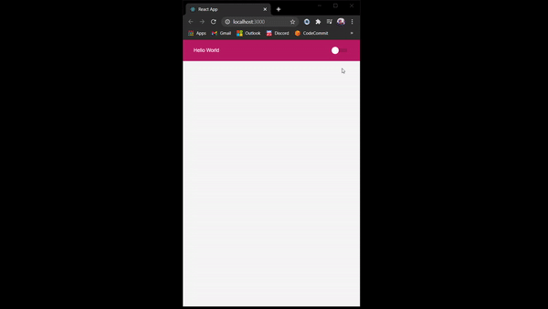

# Theme switcher w/ ReactJS 

A theme switcher application ReactJS

<p>
  
<p/>

# Start project

Run commands:
 
- ```npm install```
- ```npm start```

or, if you have Yarn 

- ```yarn install```
- ```yarn start```

After, open your browser on localhost:3000

# Did you like the project? Give a star ⭐
